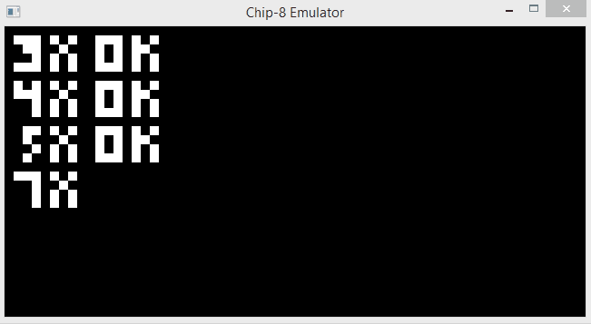

# Rust Chip-8 Emulator

This is my very first Rust project. It is based on the Austin Morlan's C++ [tutorial](https://austinmorlan.com/posts/chip8_emulator/).

It still needs some refactoring and more tests, but the main stuff is there.

I am not interested in a full emulation software, so some features are missing or not very well implemented yet (such as the screen size or the clock speed which are hardcoded for now). I was just searching for something interesting to play with Rust.

You can find several chip-8 files to test [here](https://github.com/dmatlack/chip8/tree/master/roms/games).

